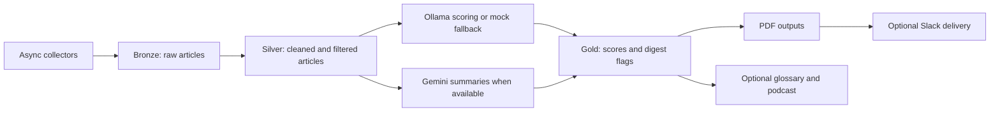

# Delta Digest

**English** | [한국어](README.ko.md)

A Python pipeline for collecting technical articles, organizing them in Delta Lake
and producing a recurring reading digest with optional model summaries and audio.

## Problem

Technical reading is spread across RSS feeds, arXiv, Hacker News and GitHub.
The project retains collected evidence, cleans article text and curates a digest
focused on Databricks and AI topics. It is a single-machine learning and automation
project; this repository does not demonstrate a managed Databricks deployment.

## Architecture



[`src/run_daily.py`](src/run_daily.py) coordinates collection, Spark transformations,
model work and output. Spark is stopped between data processing and model stages
to reduce overlap in memory usage. [`src/run_weekly.py`](src/run_weekly.py) builds
a digest from seven days of Gold data.

## Data and engineering decisions

| Layer or decision | Implemented behavior and limit |
|---|---|
| Bronze | Insert-only Delta `MERGE` keyed by URL retains the first stored raw record. It does not retain every later snapshot of that URL |
| Silver | Python UDFs remove HTML, count words, identify topic keywords and filter language; date partitions are overwritten with `replaceWhere` |
| Gold | Joins scores/summaries and marks digest selection. Default quotas are 10 Databricks, 20 AI and 10 other articles, subject to available data |
| Model routing | Ollama handles scoring; Gemini handles summaries and scriptwriting. Routing is fixed by task, not autonomous agent planning |
| Failure behavior | Unavailable Ollama leads to seeded mock scores; unavailable Gemini skips summaries. Mock output must not be presented as model evaluation |
| Deployment scope | Local Spark/Delta paths and a shell runner suit one machine. No distributed orchestration, infrastructure-as-code or production service is included |

URL-level Bronze deduplication and date-based Silver reads have different scopes:
a URL already stored on an earlier date is not inserted into today's Bronze
partition. Re-running on another day is not equivalent to processing a fresh daily
snapshot. Incoming duplicate URLs and pipeline interruption need integration tests.

`collect()` brings selected data into driver memory. Language detection is a
heuristic and errors keep an article. These choices bound the supported scale.
No latency, throughput, cloud cost or model-quality benchmark is claimed here.

## Installation and local checks

Requires Python 3.11+, `uv` and Java compatible with Spark 3.5 (Java 17 is a practical
local choice). PDF generation needs the native libraries required by WeasyPrint;
audio needs FFmpeg. Ollama and Gemini credentials are optional for the test suite.

```sh
git clone https://github.com/YongjunJeong/delta-digest.git
cd delta-digest
uv sync --locked
uv run python -m pytest -q
```

The focused tests exercise model/output logic and mocked pipeline selection.
The Bronze row test checks raw evidence, metadata serialization and ingestion-date
assignment without starting Spark. Passing these tests does not verify actual
Delta writes or a full live digest run.

## Configuration and execution

Copy [`.env.example`](.env.example) to `.env` and review
[`src/common/config.py`](src/common/config.py). Settings use the `DIGEST_` prefix:
`DIGEST_GEMINI_API_KEY`, `DIGEST_OLLAMA_BASE_URL`, `DIGEST_OLLAMA_MODEL`,
`DIGEST_DATA_DIR` and `DIGEST_OUTPUT_DIR`. Slack delivery is enabled when both
`DIGEST_SLACK_BOT_TOKEN` and `DIGEST_SLACK_CHANNEL_ID` are configured.

```sh
cp .env.example .env
uv run python -m src.run_daily --mock --no-podcast
```

**Mock mode still collects from external sources, writes local data/PDFs and can
send Slack messages when Slack credentials are configured.** It substitutes scores;
it is not a network-free demo. Use an isolated configuration without Slack tokens
when evaluating the project. Without `--mock`, the pipeline may call Gemini and
external TTS services as well as local Ollama.

```sh
uv run python -m src.run_daily --no-podcast
uv run python -m src.run_weekly
```

Review generated output before sharing it. Keep credentials, article exports,
outputs and deployment settings out of public Git history.

## Validation and next work

The original audit ran 31 tests. In the current 2026-10-09 refinement, **32 tests
passed**, including the preserved raw Bronze-row regression test. Full Spark/Delta
execution, live provider delivery and historical cloud-cost figures were not
reproduced. Mocked pipeline tests do not validate Delta writes.

The next useful checks are synthetic Spark integration tests for duplicate URLs,
partition reprocessing and failure cleanup. Add provenance for mock scores and
measure one reproducible workload before making reliability or cost claims.

## Detailed reference

The [English technical guide](docs/technical-guide.md) preserves configuration,
implementation details, operation and troubleshooting from the original guide.
